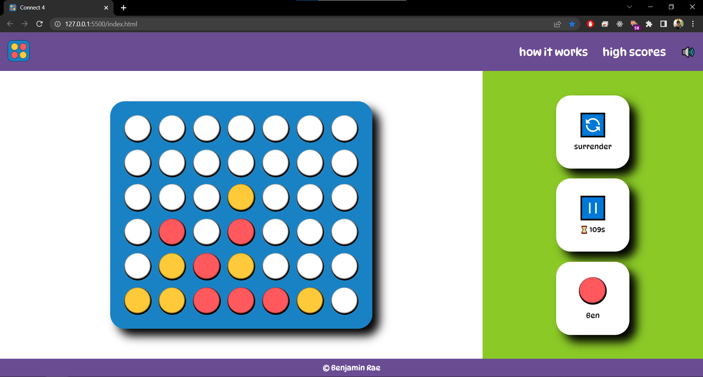

# Personal Portfolio

[Live Site](https://aquamarine-ganache-1b7af4.netlify.app/)

## About the project

---

This project was an extra part of the ISDI Coders precourse. The objective was to create a Connect 4 style game. I used CSS grid for the game grid but flexbox for the rest. The main challenge was creating logic that could be reused if the grid was resized. For horizontal and vertical wins it was easy. One a piece is placed, the row/column is checked for at least 4 consecutive counters from the same player. The diagonals were more difficult since the columns and rows don't stay constant. In the end, I create a starting point by looking for the bottom of the diagonal. Then from there checked the full diagonal for at least 4 consecutive counters by the same player.

### Built with

**Front End**

-   HTML
-   CSS
-   Javascript
-   Hosted on Netlify

### What I learned from this project

I really enjoyed this project because it was one of my first opportunities to take a problem and create the logic to solve it. I learned that drawing out a problem is one of the easiest starting points and from there I was able to create pseudocode and finally transfer it into JavaScript. It had also been a while since I'd worked on my last project so it was good fun relearning and remembering concepts, especially with CSS. I also learned that "document.getElementsByClassName" does not actually return an "Array". It returns an "HTMLCollection" which has its own prototypes.

### Next steps

-   Work on responsiveness of the page
-   Create a small backend for high scores
-   Consider online multiplayer
    -   Requires login
    -   Could be done with websockets
